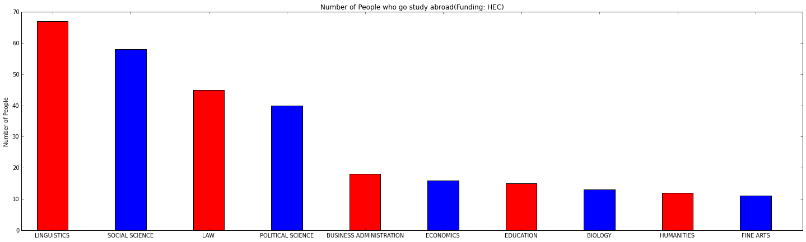

# อยากเรียนต่างประเทศ ทุนไหนฮ๊อทคณะไหนฮิต #
เคยสงสัยไหม เวลาอยากไปเรียนต่างประเทศตามคณะต่าง ๆ เราควรจะไปสอบชิงทุนไหนดี แล้วคนส่วนใหญ่เค้าสอบชิงทุนของที่ไหนกันบ้างนะ วันนี้เราเอาสถิติข้อมูลปี 2558 เดือนมีนาคม มาให้เพื่อน ๆ ได้ด้วยกันครับว่า เค้าสอบชิงทุนจากที่ไหนไปเข้าคณะอะไรกันบ้าง มาเริ่มกันเลยดีกว่า

## ดูข้อมูลเบื้องต้น ##
### Import Lib ###
อันดับแรกทำการ import library ที่จำเป็นเข้ามาก่อน


```python
import pandas as pd
import matplotlib.pyplot as plt
import numpy as np
%matplotlib inline
```

### ดูข้อมูล ###
ไหนดูซิ๊? มี้ข้อมูลอะไรบ้าง


```python
df = pd.read_csv('580331-bProgramme.csv')
df.head()
```


<div>
<table border="1" class="dataframe">
  <thead>
    <tr style="text-align: right;">
      <th></th>
      <th>(No.)</th>
      <th>(Courses)</th>
      <th>นทล  (KING)</th>
      <th>ก.พ.  (CSC)</th>
      <th>กต (MFA)</th>
      <th>วท (MOST)</th>
      <th>สธ  (MOPH)</th>
      <th>สกอ. (HEC)</th>
      <th>พสวท  (IPST)</th>
      <th>รวม(Total)</th>
      <th>(%)</th>
    </tr>
  </thead>
  <tbody>
    <tr>
      <th>0</th>
      <td>1</td>
      <td>ENGINEERING</td>
      <td>14</td>
      <td>56</td>
      <td>2</td>
      <td>279</td>
      <td>-</td>
      <td>8</td>
      <td>4</td>
      <td>363</td>
      <td>15.68</td>
    </tr>
    <tr>
      <th>1</th>
      <td>2</td>
      <td>BIOLOGY</td>
      <td>2</td>
      <td>38</td>
      <td>-</td>
      <td>115</td>
      <td>3</td>
      <td>13</td>
      <td>65</td>
      <td>236</td>
      <td>10.19</td>
    </tr>
    <tr>
      <th>2</th>
      <td>3</td>
      <td>PHYSICS</td>
      <td>-</td>
      <td>4</td>
      <td>-</td>
      <td>53</td>
      <td>-</td>
      <td>7</td>
      <td>114</td>
      <td>178</td>
      <td>7.69</td>
    </tr>
    <tr>
      <th>3</th>
      <td>4</td>
      <td>COMPUTER SCIENCE</td>
      <td>1</td>
      <td>19</td>
      <td>2</td>
      <td>84</td>
      <td>-</td>
      <td>2</td>
      <td>42</td>
      <td>150</td>
      <td>6.48</td>
    </tr>
    <tr>
      <th>4</th>
      <td>5</td>
      <td>MATHEMATICS</td>
      <td>2</td>
      <td>3</td>
      <td>-</td>
      <td>38</td>
      <td>-</td>
      <td>9</td>
      <td>81</td>
      <td>133</td>
      <td>5.75</td>
    </tr>
  </tbody>
</table>
</div>


ว้าว! มีสถิติข้อมูลแบ่งตามคณะและประเภททุนที่เราต้องการเลย ลองเอามาพลอตกราฟ ดูกันหน่อยว่า 10 คณะแรกที่คนนิยมไปกันเยอะบ้าง

### คณะไหนคนไปเยอะบ้าง ###


```python
courses = df['(Courses)']
total = df['รวม(Total)']
for i in range(0,86):
    if courses[i] == 'ไม่ระบุ':
        courses.loc[i][0] = "Undefinded"
fig, ax = plt.subplots()
fig.set_size_inches(25, 10)
N = 10
ind = np.arange(N)
width = 0.4
rects1 = ax.bar(ind+width, total[:10],width,color='rbygc',align='center')
ax.set_ylabel('Number of People')
ax.set_title('Number Of People who go study abroad(Classify by department)')
ax.set_xticks(ind+width)
ax.set_xticklabels(courses)
plt.show()
```


ยังคง Hot มากอยู่นะครับสำหรับคณะอันดับหนึ่ง นั่นก็คือ Engineering หรือ วิศวกรรมศาสตร์ ต่อมาก็คณะวิทยาศาสตร์ทั้งนั้นเลย (ชีววิทยา, ฟิสิกส์, ... ) มีคนไปเรียน Mathematics ในต่างประเทศเยอะเหมือนกันนะเนี่ย แปลว่าคนชอบคณิตศาสตร์ก็ไม่น้อยเหมือนกันนะครับ

### แบ่งดูตามประเภททุน ###
เรามาเริ่มดูจากทุนแรกกันก่อนเลยครับ ทุน นทล (KING) หรือ ทุนเล่าเรียนหลวง


```python
fund = df.ix[:,2:3]
print "ทุน นทล (KING)"
for i in range(0,86):
    if fund.loc[i][0] == "-":
        fund.loc[i][0] = 0
    else:
        fund.loc[i][0] = int(fund.loc[i][0])
fund = fund.ix[:,0]
dataF = pd.concat([courses,fund],axis=1)
dataF.columns = ['courses', 'KING']
dataS = dataF.sort(['KING'],ascending=0)
sortedCourse = dataS['courses'].reset_index(drop=True)
fund = dataS['KING']
fig, ax = plt.subplots()
fig.set_size_inches(25, 7)
N = 10
ind = np.arange(N)
width = 0.4
rects1 = ax.bar(ind+width, fund[:10], width,color='rb',align='center')
ax.set_ylabel('Number of People')
ax.set_title('Number of People who go study abroad(Funding: KING)')
ax.set_xticks(ind+width)
ax.set_xticklabels(sortedCourse)
plt.show()
```

    ทุน นทล (KING)


จะเห็นว่า ทุนเล่าเรียนหลวง ส่วนใหญ่จะเป็นคณะ เภสัชกร และ เศรษฐศาสตร์


```python
fund = df.ix[:,3:4]
print "ทุน ก.พ. (CSC)"
for i in range(0,86):
    if fund.loc[i][0] == "-":
        fund.loc[i][0] = 0
    else:
        fund.loc[i][0] = int(fund.loc[i][0])
fund = fund.ix[:,0]
dataF = pd.concat([courses,fund],axis=1)
dataF.columns = ['courses', 'CSC']
dataS = dataF.sort(['CSC'],ascending=0)
sortedCourse = dataS['courses'].reset_index(drop=True)
fund = dataS['CSC']
fig, ax = plt.subplots()
fig.set_size_inches(25, 7)
N = 10
ind = np.arange(N)
width = 0.4
rects1 = ax.bar(ind+width, fund[:10], width,color='rb',align='center')
ax.set_ylabel('Number of People')
ax.set_title('Number of People who go study abroad(Funding: CSC)')
ax.set_xticks(ind+width)
ax.set_xticklabels(sortedCourse)
plt.show()

```

    ทุน ก.พ. (CSC)


ต่อมาคือทุน ก.พ. (CSC) หรือ ทุนรัฐบาล ส่วนใหญ่ไปเรียนกฏหมาย กับ รัฐศาสตร์


```python
fund = df.ix[:,4:5]
print "ทุน กต(MFA)"
for i in range(0,86):
    if fund.loc[i][0] == "-":
        fund.loc[i][0] = 0
    else:
        fund.loc[i][0] = int(fund.loc[i][0])
fund = fund.ix[:,0]
dataF = pd.concat([courses,fund],axis=1)
dataF.columns = ['courses', 'MFA']
dataS = dataF.sort(['MFA'],ascending=0)
sortedCourse = dataS['courses'].reset_index(drop=True)
fund = dataS['MFA']
fig, ax = plt.subplots()
fig.set_size_inches(25, 7)
N = 10
ind = np.arange(N)
width = 0.4
rects1 = ax.bar(ind+width, fund[:10], width,color='rb',align='center')
ax.set_ylabel('Number of People')
ax.set_title('Number of People who go study abroad(Funding: MFA)')
ax.set_xticks(ind+width)
ax.set_xticklabels(sortedCourse)
plt.show()
```

    ทุน กต(MFA)


ต่อมาคือทุน กต (MFA) หรือ ทุนของกระทรวงการต่างประเทศ ส่วนใหญ่ไปเรียนรัฐศาสตร์ กับ สังคมศาสตร์


```python
fund = df.ix[:,5:6]
print "ทุน วท(MOST)"
for i in range(0,86):
    if fund.loc[i][0] == "-":
        fund.loc[i][0] = 0
    else:
        fund.loc[i][0] = int(fund.loc[i][0])
fund = fund.ix[:,0]
dataF = pd.concat([courses,fund],axis=1)
dataF.columns = ['courses', 'MOST']
dataS = dataF.sort(['MOST'],ascending=0)
sortedCourse = dataS['courses'].reset_index(drop=True)
fund = dataS['MOST']
fig, ax = plt.subplots()
fig.set_size_inches(25, 7)
N = 10
ind = np.arange(N)
width = 0.4
rects1 = ax.bar(ind+width, fund[:10], width,color='rb',align='center')
ax.set_ylabel('Number of People')
ax.set_title('Number of People who go study abroad(Funding: MOST)')
ax.set_xticks(ind+width)
ax.set_xticklabels(sortedCourse)
plt.show()
```

    ทุน วท(MOST)


ต่อมาคือทุน วท (MOST) หรือ ทุนของกระทรวงวิทยาศาสตร์และเทคโนโลยี ส่วนใหญ่ไปเรียนวิศวกรรมศาสตร์ กับ ชีววิทยา


```python
fund = df.ix[:,6:7]
print "ทุน สธ (MOPH)"
for i in range(0,86):
    if fund.loc[i][0] == "-":
        fund.loc[i][0] = 0
    else:
        fund.loc[i][0] = int(fund.loc[i][0])
fund = fund.ix[:,0]
dataF = pd.concat([courses,fund],axis=1)
dataF.columns = ['courses', 'MOPH']
dataS = dataF.sort(['MOPH'],ascending=0)
sortedCourse = dataS['courses'].reset_index(drop=True)
fund = dataS['MOPH']
fig, ax = plt.subplots()
fig.set_size_inches(25, 7)
N = 10
ind = np.arange(N)
width = 0.4
rects1 = ax.bar(ind+width, fund[:10], width,color='rb',align='center')
ax.set_ylabel('Number of People')
ax.set_title('Number of People who go study abroad(Funding: MOPH)')
ax.set_xticks(ind+width)
ax.set_xticklabels(sortedCourse)
plt.show()
```

    ทุน สธ (MOPH)


ต่อมาคือทุน สธ (MOPH) หรือ ทุนของกระทรวงสาธารณสุข ส่วนใหญ่ไป พยาบาล และเภสัช ก็ตามทุนเลย สายหมอทางนี้จ้า


```python
fund = df.ix[:,7:8]
print "ทุน สกอ.(HEC)"
for i in range(0,86):
    if fund.loc[i][0] == "-":
        fund.loc[i][0] = 0
    else:
        fund.loc[i][0] = int(fund.loc[i][0])
fund = fund.ix[:,0]
dataF = pd.concat([courses,fund],axis=1)
dataF.columns = ['courses', 'HEC']
dataS = dataF.sort(['HEC'],ascending=0)
sortedCourse = dataS['courses'].reset_index(drop=True)
fund = dataS['HEC']
fig, ax = plt.subplots()
fig.set_size_inches(25, 7)
N = 10
ind = np.arange(N)
width = 0.4
rects1 = ax.bar(ind+width, fund[:10], width,color='rb',align='center')
ax.set_ylabel('Number of People')
ax.set_title('Number of People who go study abroad(Funding: HEC)')
ax.set_xticks(ind+width)
ax.set_xticklabels(sortedCourse)
plt.show()
```

    ทุน สกอ.(HEC)





ต่อมาคือทุน สกอ (HEC) หรือ ทุนของกระทรวงศึกษาธิการ ส่วนใหญ่ไปเรียน ภาษาศาสตร์, สังคมศาสตร์, รัฐศาสตร์, กฏหมาย สายศิลป์น่าจะเหมาะ


```python
fund = df.ix[:,8:9]
print "ทุน พสวท(IPST)"
for i in range(0,86):
    if fund.loc[i][0] == "-":
        fund.loc[i][0] = 0
    else:
        fund.loc[i][0] = int(fund.loc[i][0])
fund = fund.ix[:,0]
dataF = pd.concat([courses,fund],axis=1)
dataF.columns = ['courses', 'IPST']
dataS = dataF.sort(['IPST'],ascending=0)
sortedCourse = dataS['courses'].reset_index(drop=True)
fund = dataS['IPST']
fig, ax = plt.subplots()
fig.set_size_inches(25,7)
N = 10
ind = np.arange(N)
width = 0.4
rects1 = ax.bar(ind+width, fund[:10], width,color='rb',align='center')
ax.set_ylabel('Number of People')
ax.set_title('Number of People who go study abroad(Funding: IPST)')
ax.set_xticks(ind+width)
ax.set_xticklabels(sortedCourse)
plt.show()
```

    ทุน พสวท(IPST)


และทุนสุดท้ายคือทุน พสวท(IPST) หรือ ทุนของสถาบันส่งเสริมการสอนวิทยาศาสตร์และเทคโนโลยี ส่วนใหญ่ไปเรียนฟิสิกส์,คณิตศาสร์,เคมี,ชีววิทยา สายวิทย์ต้องทุนนี้เลย

## สรุป ###
ก็แต่ละทุนก็แทบจะแบ่งสายได้เลย ดูจากกราฟจะเห็นว่า

| ประเภททุน           | คณะ              |
| ------------------: |:-----------------|
| ทุน นทล (KING)      | เภสัชกร และ เศรษฐศาสตร์     |
| ทุน ก.พ. (CSC)      | กฏหมาย, รัฐศาสตร์  |
| ทุน กต (MFA)        | รัฐศาสตร์, สังคมศาสตร์ |
| ทุน วท (MOST)       | วิศวกรรมศาสตร์     |
| ทุน สธ (MOPH)       | พยาบาล และเภสัช            |
| ทุน สกอ. (HEC)      |ภาษาศาสตร์,สังคมศาสตร์, กฏหมาย, รัฐศาสตร์ |
| ทุน พสวท (IPST)     |สายวิทยาศาสตร์ทั้งหลาย |

เห็นแบบนี้แล้วน่าจะช่วยให้เพื่อน ๆ สอบชิงทุนกันได้ตรงตามคณะที่อยากจะศึกษาต่อกันได้แล้ว เย้~!
